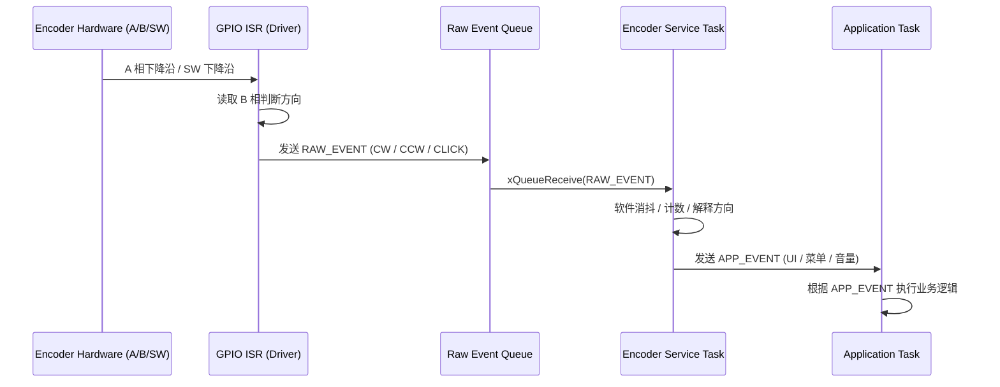

# 从任务到队列：我在 ESP32-S3 上理解 FreeRTOS 的一次完整实践

> 这篇文章不是一份 FreeRTOS API 手册，而是我在 ESP32-S3 实际开发过程中，**从“先把程序跑起来”，到“开始关心系统结构是否合理”**的一次完整记录。
---
## 一、为什么我一开始并不关心 FreeRTOS 的“高级用法”

刚开始用 ESP32-S3 的时候，说实话，我对 FreeRTOS 的态度非常功利：
* 能跑就行
* 一个 `app_main()` 写到底
* 最多加一两个 task，看起来“像那么回事”

那时我对 **任务、队列、优先级、阻塞** 这些概念都有印象，但并没有形成“为什么要这样设计”的认知。
直到后来开始接触一些**持续运行、外设较多、事件频繁**的功能，我才发现：

> 不是 FreeRTOS 难，而是我一开始用错了方式。

---

## 二、FreeRTOS 中的“任务”，并不只是 while(1)

从官方角度看，FreeRTOS 的 task 本质上就是一个独立调度的执行单元。但在实际项目里，我逐渐意识到：

**任务真正解决的不是并发，而是职责边界。**
### 1. 一个任务，应该只关心一类事情

在我后来看文档、回头审视自己代码时，发现一个明显问题：
* 一个 task 里既处理 GPIO
* 又处理协议
* 还顺带打日志

这种写法在功能少的时候还能忍，但一旦外设多起来，代码很快失控。
IDF默认是集成了实时操作系统FreeRTOS的，所以FreeRTOS相关接口我们都是可以用的。

但是需要注意的是，IDF的例程中，是不会单独对FreeRTOS通用的任务创建、任务通信等RTOS相关特性进行讲解，这部分我们可以参考FreeRTOS官方文档或者IDF API文档进行了解。

```c
#include "freertos/task.h"

BaseType_t xTaskCreate(
    TaskFunction_t pxTaskCode,
    const char *const pcName,
    const configSTACK_DEPTH_TYPE usStackDepth,
    void *const pvParameters,
    UBaseType_t uxPriority,
    TaskHandle_t *const pxCreatedTask
);
功能: xTaskCreate 函数用于创建一个新的 FreeRTOS 任务。该函数分配任务所需的内存，并初始化任务控制块（TCB），然后将任务添加到就绪列表中，等待调度器运行该任务。
参数:
pxTaskCode: 指向任务函数的指针。任务函数的原型必须为 void TaskFunction(void *pvParameters)。
pcName: 任务的名称，用于调试和日志记录。长度不能超过 configMAX_TASK_NAME_LEN 个字符。
usStackDepth: 任务堆栈的大小，以字为单位
pvParameters: 传递给任务函数的参数。
uxPriority: 任务的优先级。优先级值越高，任务的优先级越高。优先级值的范围通常是 0 到 configMAX_PRIORITIES - 1。
pxCreatedTask: 用于存储新创建任务的句柄。如果不需要任务句柄，可以传递 NULL。
返回值:
pdPASS: 任务创建成功。

```


---

## 三、队列不是“通信手段”，而是架构工具

在正式用队列之前，我也纠结过：

> 直接用全局变量不是更简单吗？

而IDF集成了FreeRTOS后，我们就可以直接使用FreeRTOS的队列功能，来实现任务与任务，中断与任务的通信。
```c
头文件
#include "freertos/queue.h"

QueueHandle_t xQueueCreate(
    UBaseType_t uxQueueLength,
    UBaseType_t uxItemSize
);
功能: xQueueCreate 函数用于创建一个队列，用于在任务之间传递数据。队列可以用于同步和通信，确保数据在任务之间的安全传递。
参数:
uxQueueLength: 队列中可以容纳的最大项数。
uxItemSize: 队列中每一项的大小（以字节为单位）。
返回值:
QueueHandle_t: 队列句柄。如果队列创建失败，返回 NULL。

BaseType_t xQueueSend(
    QueueHandle_t xQueue,
    const void *pvItemToQueue,
    TickType_t xTicksToWait
);
功能: xQueueSend 函数用于将数据项发送到队列中。如果队列已满，任务可以选择等待队列中有空间可用，或者立即返回。
参数:
xQueue: 队列句柄，由 xQueueCreate 函数返回。
pvItemToQueue: 指向要发送的数据项的指针。
xTicksToWait: 任务在队列满时等待的时间。可以使用 portMAX_DELAY 表示无限等待，直到队列中有空间可用。
返回值:
pdPASS: 数据项成功发送到队列。
errQUEUE_FULL: 队列已满，任务未在指定时间内发送数据项。


BaseType_t xQueueReceive(
    QueueHandle_t xQueue,
    void *pvBuffer,
    TickType_t xTicksToWait
);
功能: xQueueReceive 函数用于从队列中接收数据项。如果队列为空，任务可以选择等待队列中有数据可用，或者立即返回。
参数:
xQueue: 队列句柄，由 xQueueCreate 函数返回。
pvBuffer: 指向存储接收到的数据项的缓冲区的指针。
xTicksToWait: 任务在队列空时等待的时间。可以使用 portMAX_DELAY 表示无限等待，直到队列中有数据可用。
返回值:
pdPASS: 数据项成功从队列接收。
errQUEUE_EMPTY: 队列为空，任务未在指定时间内接收数据项。
```

但真正按文档里的方式，用队列把中断、任务串起来之后，我才理解：

**队列解决的是“谁该在什么时候碰数据”的问题。**

### 1. 队列在 FreeRTOS 里的真实角色

队列至少解决了三件事：

* **同步**：没有数据就阻塞
* **解耦**：生产者不关心消费者是谁
* **安全**：天然线程安全

尤其是当数据来自中断时，这种价值会被无限放大。



---

## 四、为什么文档选择“编码器”作为示例

我并没有随便选一个例子，而是用了**旋转编码器**这个外设。
我使用的是轮滚轮旋转编码器EC11E153440D：https://item.szlcsc.com/3244962.html

编码器有四根线，A\B是编码输出，S是按钮状态，C是公共端。 
从给出的数据手册上面我们看到一个波形，我们就是通过这个波形去判断编码器是否转动以及编码器转动的方向


### 编码器这个外设，天然制造问题


* 边沿密集
* 中断频繁
* 对实时性有要求
* ISR 里不能做复杂逻辑

这就逼着你必须思考：

> **中断里到底该做什么？**

---

## 五、编码器驱动中，我真正用上任务和队列的地方

### 1. 中断只负责“采样”，不负责“决策”

编码器 GPIO 中断里只做一件事：
* 读取当前引脚状态
* 组织成最小数据结构
* 投递到队列

中断函数不关心：
* 当前是正转还是反转
* 计数加还是减
* 业务如何处理

```c
static void IRAM_ATTR encoder_gpio_isr(void* arg)
{
    encoder_event_t event;

    // A 相下降沿触发中断，此时只需要读 B 相
    if (gpio_get_level(GPIO_EN_B_IO) == 0) {
        event = ENCODER_EVENT_CCW;
    } else {
        event = ENCODER_EVENT_CW;
    }

    xQueueSendFromISR(queue, &event, NULL);
}


static void IRAM_ATTR sw_gpio_isr(void* arg)
{
    uint64_t now = esp_timer_get_time() / 1000; // ms
    if (now - last_sw_time < DEBOUNCE_TIME_MS) {
        return;
    }
    last_sw_time = now;

    encoder_event_t event = ENCODER_EVENT_CLICK;
    xQueueSendFromISR(sw_queue, &event, NULL);
}

```

---

### 2. 编码器任务，才是逻辑的“唯一主人”

真正的编码器逻辑，都集中在一个独立的 FreeRTOS 任务中：
* 阻塞等待队列数据
* 解析相位关系
* 更新计数值
* 必要时上报给其他模块

这个时候，我第一次清晰地感觉到：
> **任务不是为了并发，而是为了把复杂性关在一个房间里。**

```c

static void encoder_task(void* arg)
{
    encoder_event_t event;
    printf("encoder_task OK\r\n");
    while (1) {
        if (xQueueReceive(queue, &event, portMAX_DELAY)) {
            switch (event) {
            case ENCODER_EVENT_CW:
                printf("顺时针\r\n");
                ESP_LOGW(TAG, "顺时针");
                break;
            case ENCODER_EVENT_CCW:
                printf("逆时针\r\n");
                ESP_LOGW(TAG, "逆时针");
                break;
            case ENCODER_EVENT_CLICK:
                printf("按键\r\n");
                ESP_LOGW(TAG, "按键");
                break;
            default:
                break;
            }
        }
    }
}

```
---
## 六、从这个例子里，我对 FreeRTOS 的认知变化

**完整代码**
```c

#include <stdio.h>
#include <unistd.h>
#include <sys/lock.h>
#include <sys/param.h>
#include "freertos/FreeRTOS.h"
#include "freertos/task.h"
#include "freertos/queue.h"
#include "driver/gpio.h"
#include "esp_err.h"
#include "esp_log.h"
#include "esp_timer.h"

static const char *TAG = "example";

#define GPIO_EN_A_IO 4
#define GPIO_EN_B_IO 5
#define GPIO_EN_SW_IO 6
#define GPIO_EN_A_PIN_SEL (1ULL << GPIO_EN_A_IO)
#define GPIO_EN_B_PIN_SEL (1ULL << GPIO_EN_B_IO)
#define GPIO_EN_SW_PIN_SEL (1ULL << GPIO_EN_SW_IO)

static bool is_ccw_start = false;
static bool is_cw_start = false;

#define DEBOUNCE_TIME_MS 100  // 去抖动时间(毫秒)
static uint64_t last_sw_time = 0;

typedef enum {
    ENCODER_EVENT_NONE = 0,
    ENCODER_EVENT_CW,
    ENCODER_EVENT_CCW,
    ENCODER_EVENT_CLICK,
} encoder_event_t;

static QueueHandle_t queue = NULL;
static QueueHandle_t sw_queue = NULL;

//设置ccw方向标志位，起始或结束标志
void set_ccw_status(){
    encoder_event_t event = ENCODER_EVENT_CCW;
    if(is_ccw_start == true){
        xQueueSendFromISR(queue, &event, NULL);
    }else 
        is_ccw_start = true; //首次触发为开始
    is_cw_start = false; //如果是CCW方向的触发，可以把CW方向的标志清空
}

//设置cw方向标志位，起始或结束标志
void set_cw_status(){
    encoder_event_t event = ENCODER_EVENT_CW;
    if(is_cw_start == true){
        xQueueSendFromISR(queue, &event, NULL);
    }else 
        is_cw_start = true;
    is_ccw_start = false; //如果是CW方向的触发，可以把CCW方向的标志清空
}

static void IRAM_ATTR encoder_gpio_isr(void* arg)
{
    encoder_event_t event;

    // A 相下降沿触发中断，此时只需要读 B 相
    if (gpio_get_level(GPIO_EN_B_IO) == 0) {
        event = ENCODER_EVENT_CCW;
    } else {
        event = ENCODER_EVENT_CW;
    }

    xQueueSendFromISR(queue, &event, NULL);
}


static void IRAM_ATTR sw_gpio_isr(void* arg)
{
    uint64_t now = esp_timer_get_time() / 1000; // ms
    if (now - last_sw_time < DEBOUNCE_TIME_MS) {
        return;
    }
    last_sw_time = now;

    encoder_event_t event = ENCODER_EVENT_CLICK;
    xQueueSendFromISR(sw_queue, &event, NULL);
}

static void encoder_task(void* arg)
{
    encoder_event_t event;
    printf("encoder_task OK\r\n");
    while (1) {
        if (xQueueReceive(queue, &event, portMAX_DELAY)) {
            switch (event) {
            case ENCODER_EVENT_CW:
                printf("顺时针\r\n");
                ESP_LOGW(TAG, "顺时针");
                break;
            case ENCODER_EVENT_CCW:
                printf("逆时针\r\n");
                ESP_LOGW(TAG, "逆时针");
                break;
            case ENCODER_EVENT_CLICK:
                printf("按键\r\n");
                ESP_LOGW(TAG, "按键");
                break;
            default:
                break;
            }
        }
    }
}


void encoder_gpio_init(void)
{
    gpio_config_t io_conf = {0};

    // A 相：下降沿中断
    io_conf.intr_type = GPIO_INTR_NEGEDGE;
    io_conf.pin_bit_mask = GPIO_EN_A_PIN_SEL;
    io_conf.mode = GPIO_MODE_INPUT;
    io_conf.pull_up_en = GPIO_PULLUP_DISABLE;
    gpio_config(&io_conf);

    // B 相：普通输入
    io_conf.intr_type = GPIO_INTR_DISABLE;
    io_conf.pin_bit_mask = GPIO_EN_B_PIN_SEL;
    gpio_config(&io_conf);

    // SW：下降沿中断 + 上拉
    io_conf.intr_type = GPIO_INTR_NEGEDGE;
    io_conf.pin_bit_mask = GPIO_EN_SW_PIN_SEL;
    io_conf.pull_up_en = GPIO_PULLUP_ENABLE;
    gpio_config(&io_conf);

    gpio_install_isr_service(0);
    gpio_isr_handler_add(GPIO_EN_A_IO, encoder_gpio_isr, NULL);
    gpio_isr_handler_add(GPIO_EN_SW_IO, sw_gpio_isr, NULL);
    printf("gpio INIT OK\r\n");
}


void app_main(void)
{
    queue = xQueueCreate(10, sizeof(encoder_event_t));
    sw_queue = queue;  // 如果你愿意，也可以合并成一个队列

    encoder_gpio_init();

    xTaskCreate(encoder_task, "encoder_task", 2048, NULL, 10, NULL);
    printf("main OK\r\n");
}

```

仿真图中编码器的引脚示意如下：

Name	|Description
---------|----------
CLK	|旋转编码器引脚A
DT	|旋转编码器引脚B
SW	| 常开按键，按下低电平
VCC|	推荐接3V
GND|	接地

当顺逆时针转动、按键按下时，都会向队列发送数据，任务作为状态机接收到相应的信息，打印不同的内容。

打印如下：

在写完编码器这一整套结构之后，我对 FreeRTOS 的理解发生了变化：
* 它不是“多线程框架”
* 也不是“写起来更复杂的 C 程序”
* 而是一套**约束你如何组织代码的工具**

编码器只是一个开始，但同样的模式，后面可以无缝迁移到：
* 按键系统
* 串口接收
* 传感器采样
* 网络事件处理
---

## 七、一些官方文档，反而是在“写完代码之后”才看懂

回头再去看官方文档我才发现很多话：

* 并不是写给新手看的
* 而是写给**已经踩过坑的人看的**

IDF freertos api ：`https://docs.espressif.com/projects/esp-idf/zh_CN/v5.4/esp32s3/api-reference/system/freertos_idf.html`
freertos 官方api：`https://www.freertos.org/zh-cn-cmn-s/Documentation/02-Kernel/04-API-references/01-Task-creation/01-xTaskCreate`

---

## 结语

这篇文章并不是在“教你怎么用 FreeRTOS”，而是记录了我在 ESP32-S3 项目中，**从能跑，到开始在意结构是否正确**的一个过程。

如果你现在也正处在：

* FreeRTOS API 都见过
* 但不知道什么时候该用任务、什么时候该用队列

那编码器这个例子，可能会是一个不错的切入点。

至少对我来说，它让我第一次觉得：

> **FreeRTOS 用得好，是能让人写代码写得更安心的。**


