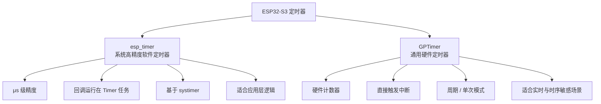
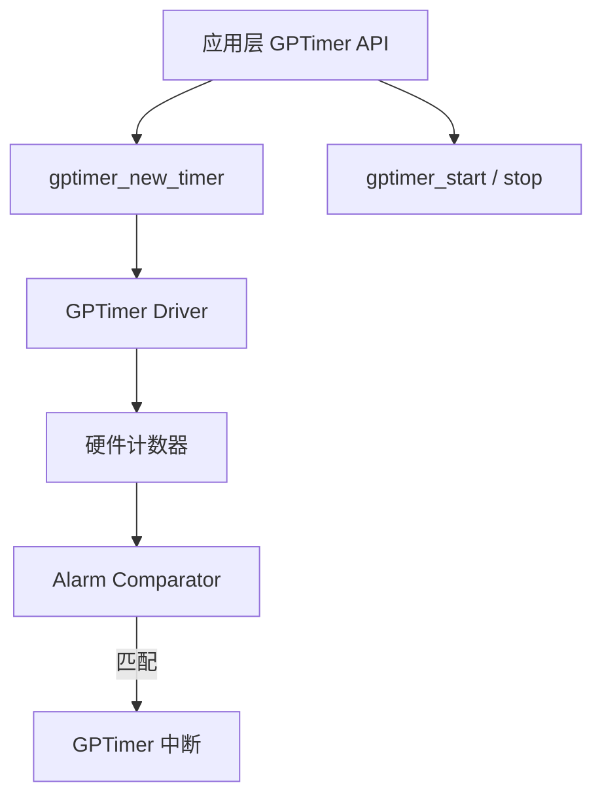

# ESP32-S3 定时器详解：esp_timer 与 GPTimer 的工程级选择

在真正开始写业务代码之前，我花了不少时间卡在 ESP32-S3 的“时间”问题上。
最开始只是想**每隔一段时间打印一次日志**，后来却逐渐意识到：

> **在 ESP32-S3 上，定时器看起来简单，但如果选错，用得越久，问题越多。**

这篇文章基于 **ESP-IDF 官方文档**，结合我在实际项目中的踩坑经历，系统梳理 ESP32-S3 中**真正会用到的两类定时器**，以及它们在工程中的正确定位。

---

## 一、为什么在 ESP32-S3 上，定时器格外重要

在 PC 世界里，时间往往不是一种需要认真管理的资源；
但在 MCU 上，**时间几乎等同于系统秩序本身**。

在 ESP32-S3 的实际项目中，定时器通常承担着这些角色：
* 周期性任务的节拍源（心跳、轮询、状态检测）
* 精准延时（替代 vTaskDelay 的部分场景）
* 软件架构中的“时间基准”（状态机、超时控制）
* 中断级别的时间触发（采样、控制、同步）

而 ESP32-S3 并不是只有“一种定时器”。
真正让我一开始感到混乱的，是**不同定时器解决的是不同层级的问题**。



在展开 API 之前，先给一个结论：

> **esp_timer 和 GPTimer 不是“谁更高级”，而是“谁更合适”。**

---

## 二、ESP32-S3 中你真正会用到的两类定时器

### 1️⃣ esp_timer：应用层首选的高精度软件定时器

这是我**最先接触、也是项目中用得最多的一种定时器**。

### 它是什么

* ESP-IDF 提供的高精度软件定时器
* 基于系统的 `systimer`
* 精度可达微秒级
### 它运行在哪

**非常重要的一点：**
> esp_timer 的回调函数**运行在专用的 Timer Service 任务上下文中**，
> **不是中断上下文**。

这意味着：
* 会受到 FreeRTOS 调度影响
* 适合做业务层逻辑
* 不适合做强实时控制

### 适合什么场景
* 周期性业务逻辑
* 状态检测、心跳
* 超时控制
* 定时“唤醒”任务

ESP-IDF 官方也明确将 esp_timer 定位为：
**应用层定时任务的首选方案**。

---

### esp_timer 基本用法示例（1 秒周期）

```c
#include <stdio.h>
#include "freertos/FreeRTOS.h"
#include "freertos/task.h"
#include "esp_log.h"
#include "esp_timer.h"

static const char *TAG = "esp_timer_example";

static void timer_callback(void* arg)
{
    ESP_LOGI(TAG, "Timer update!");
}

void app_main(void)
{
    esp_timer_create_args_t timer_args = {
        .callback = &timer_callback,
        .name = "example_timer"
    };

    esp_timer_handle_t timer;
    esp_timer_create(&timer_args, &timer);

    // 启动 1 秒周期定时器
    esp_timer_start_periodic(timer, 1000000);

    while (1) {
        vTaskDelay(pdMS_TO_TICKS(100));
    }
}
```
每过一秒将会打印一次：


在实际工程中，我通常遵循一个原则：

> **esp_timer 的回调里，只做“事件触发”，不做复杂逻辑。**

比如：
* 发送队列
* 通知任务
* 设置状态标志

这样可以避免 Timer 任务被长期占用，影响系统整体调度。
#### esp_timer 的天然限制
* 回调不是 ISR
* 不适合极端实时场景
* 不适合和外设时序强绑定的逻辑

当你开始关心“这一拍必须准时发生”，
**esp_timer 往往就已经不够用了**。

---

## 2️⃣ GPTimer：真正的硬件通用定时器

当我开始写编码器驱动、按键消抖、PWM 同步这些逻辑时，很快发现：
> **时间不仅要“准”，还要“和硬件对齐”。**

这正是 GPTimer 存在的意义。
### GPTimer 是什么
* ESP32-S3 的**硬件通用定时器**
* 由硬件计数器驱动
* 可直接触发中断
* 行为接近传统 MCU 的 Timer 外设

ESP-IDF 将其单独封装成 GPTimer 驱动，相比早期的 timer group，用法清晰很多。

---

### GPTimer 的典型使用流程
**四个步骤，缺一不可：**
1. 创建定时器（时钟源 / 分辨率 / 计数方向）
2. 注册中断回调
3. 设置报警动作
4. 启动定时器

#### 创建定时器（1μs 分辨率）

```c
gptimer_handle_t gptimer = NULL;

gptimer_config_t timer_config = {
    .clk_src = GPTIMER_CLK_SRC_DEFAULT,
    .direction = GPTIMER_COUNT_UP,
    .resolution_hz = 1000000, // 1MHz -> 1μs
};

gptimer_new_timer(&timer_config, &gptimer);


```
**gptimer_new_timer**
```c
esp_err_t gptimer_new_timer(const gptimer_config_t *config, gptimer_handle_t *ret_timer);
功能: gptimer_new_timer 函数用于根据指定的配置创建一个新的通用定时器实例。
参数:
config: 指向 gptimer_config_t 结构体的指针，包含定时器的配置参数。
ret_timer: 指向 gptimer_handle_t 类型的指针，用于存储新创建的定时器句柄。
返回值:
ESP_OK: 定时器创建成功。
ESP_ERR_INVALID_ARG: 参数无效。
ESP_ERR_NO_MEM: 内存分配失败。
ESP_ERR_NOT_FOUND: 没有可用的定时器硬件资源。

gptimer_config_t 结构体用于定义和配置一个通用定时器。你可以指定定时器的时钟源、计数方向和分辨率。
typedef struct {
    gptimer_clock_source_t clk_src;       //!< Clock source for the timer
    gptimer_count_direction_t direction;  //!< Count direction (up or down)
    uint32_t resolution_hz;               //!< Timer resolution in Hz
} gptimer_config_t;

gptimer_clock_source_t clk_src:
描述: 指定定时器使用的时钟源。可以是以下值之一：
GPTIMER_CLK_SRC_DEFAULT: 使用默认的时钟源。
GPTIMER_CLK_SRC_APB: 使用 APB 时钟源。
GPTIMER_CLK_SRC_XTAL: 使用晶振时钟源。

gptimer_count_direction_t direction:
描述: 指定定时器的计数方向。可以是以下值之一：
GPTIMER_COUNT_UP: 定时器向上计数。
GPTIMER_COUNT_DOWN: 定时器向下计数。

uint32_t resolution_hz:
描述: 定时器的分辨率，以 Hz 为单位。分辨率决定了定时器的计数周期。
例如，1000000 表示每个计数周期为 1 微秒。

```

我通常会直接把分辨率设为 **1MHz**，
这样后续所有时间计算都可以直接按“微秒”来思考，极大降低心智负担。

---

#### 注册中断回调
报警时执行的函数。
```c
    // 为定时器注册事件回调函数，并将之前创建的队列句柄作为用户数据传递给回调函数
    gptimer_event_callbacks_t cbs = {
        // 当定时器达到报警值时，调用 example_timer_on_alarm_cb_v1 函数
        .on_alarm = example_timer_on_alarm_cb_v1,
    };
    gptimer_register_event_callbacks(gptimer, &cbs, queue);
    gptimer_enable(gptimer);
```


**gptimer_register_event_callbacks**
```c
esp_err_t gptimer_register_event_callbacks(gptimer_handle_t timer, const gptimer_event_callbacks_t *cbs, void *user_data);
功能: gptimer_register_event_callbacks 函数用于为定时器注册事件回调函数，并传递用户数据给回调函数。
参数:
timer: 定时器句柄，由 gptimer_new_timer 函数返回。
cbs: 指向 gptimer_event_callbacks_t 结构体的指针，包含定时器的事件回调函数。
user_data: 传递给回调函数的用户数据。这个参数可以是任何类型的数据，通常用于传递回调函数需要的上下文信息。
返回值:
ESP_OK: 回调函数注册成功。
ESP_ERR_INVALID_ARG: 参数无效。
ESP_ERR_NOT_SUPPORTED: 定时器不支持事件回调。

gptimer_event_callbacks_t结构体用于定义和配置通用定时器（GPTimer）的事件回调函数。
typedef struct {
    gptimer_alarm_cb_t on_alarm;  
} gptimer_event_callbacks_t;
gptimer_alarm_cb_t on_alarm:
类型: gptimer_alarm_cb_t
描述: 指向定时器达到报警值时要执行的回调函数的指针。回调函数的原型必须为 bool on_alarm(gptimer_handle_t timer, const gptimer_alarm_event_data_t *edata, void *user_data)。

```
**gptimer_enable**
```c
esp_err_t gptimer_enable(gptimer_handle_t timer);
功能: gptimer_enable 函数用于启用一个已配置的定时器。
参数:
timer: 定时器句柄，由 gptimer_new_timer 函数返回。
返回值:
ESP_OK: 定时器启用成功。
ESP_ERR_INVALID_ARG: 参数无效。
ESP_ERR_INVALID_STATE: 定时器已经启用。
```

####  设置报警动作
计数到什么值报警，是否重载
```c
    // 为定时器设置报警动作，定义一个定时器报警配置结构体，用于设置定时器的报警参数
    gptimer_alarm_config_t alarm_config1 = {
        // 定时器的报警计数值为 1000000，由于分辨率为 1MHz，所以报警周期为 1 秒
        .alarm_count = 1000000, 
        // 当定时器达到报警值时，计数器将重新加载为 0
        .reload_count = 0,                  
        // 启用定时器自动重载功能，即每次达到报警值后自动重新开始计数
        .flags.auto_reload_on_alarm = true, 
    };
    gptimer_set_alarm_action(gptimer, &alarm_config1);
```
**gptimer_set_alarm_action**
```c
esp_err_t gptimer_set_alarm_action(gptimer_handle_t timer, const gptimer_alarm_config_t *config);
功能: gptimer_set_alarm_action 函数用于设置定时器的报警动作。通过这个函数，你可以配置定时器的报警计数值、重载计数值以及是否启用自动重载功能。
参数:
timer: 定时器句柄，由 gptimer_new_timer 函数返回。
config: 指向 gptimer_alarm_config_t 结构体的指针，包含定时器的报警配置参数。
返回值:
ESP_OK: 报警动作设置成功。
ESP_ERR_INVALID_ARG: 参数无效。
ESP_ERR_INVALID_STATE: 定时器未创建或已启用。

gptimer_alarm_config_t 定时器的报警计数值。当定时器的计数值达到这个值时，会触发报警事件。
typedef struct {
    uint64_t alarm_count;                   //!< Alarm count value
    uint64_t reload_count;                  //!< Reload count value when alarm occurs
    struct {
        bool auto_reload_on_alarm;          //!< Enable auto-reload on alarm
    } flags;
} gptimer_alarm_config_t;
uint64_t alarm_count:

uint64_t reload_count:
描述: 定时器在达到报警值时重新加载的计数值。如果启用了自动重载功能，定时器会在每次达到报警值后自动重新加载为这个值。

struct { bool auto_reload_on_alarm; } flags:
描述: 包含定时器的标志配置。
auto_reload_on_alarm: 布尔值，指定是否在定时器达到报警值时自动重新加载计数器。如果设置为 true，定时器会在每次达到报警值后自动重新加载为 reload_count 的值。
```
#### 启动定时器
一切配置完成后，记得启动定时器即可。
```c
    // 启动定时器，开始计数
    gptimer_start(gptimer);
```
#### GPTimer ISR：只做一件事

在 GPTimer 的中断回调中，**唯一正确的做法是**：
* 不做业务逻辑
* 不打印日志
* 只做事件通知

```c
static bool IRAM_ATTR example_timer_on_alarm_cb_v1(gptimer_handle_t timer, const gptimer_alarm_event_data_t *edata, void *user_data)
{
    // 用于标记在中断服务程序中是否有高优先级任务被唤醒
    BaseType_t high_task_awoken = pdFALSE;
    // 将传入的用户数据转换为队列句柄类型
    QueueHandle_t queue = (QueueHandle_t)user_data;
    static uint64_t count = 0;
    count ++;
    // 从中断服务程序中向队列发送数据（即当前的计数 count）
    xQueueSendFromISR(queue, &count, &high_task_awoken);
    // 返回是否需要在中断服务程序结束时进行任务切换 如果 high_task_awoken 为 pdTRUE，则需要进行任务切换
    return (high_task_awoken == pdTRUE);
}
```

---

#### 设置 1 秒周期报警并启动

```c
#include <stdio.h>
#include "freertos/FreeRTOS.h"
#include "freertos/task.h"
#include "freertos/queue.h"
#include "driver/gptimer.h"
#include "esp_log.h"

static const char *TAG = "Timer";

// 定义定时器报警事件的回调函数，当定时器达到报警值时会调用此函数
static bool IRAM_ATTR example_timer_on_alarm_cb_v1(gptimer_handle_t timer, const gptimer_alarm_event_data_t *edata, void *user_data)
{
    // 用于标记在中断服务程序中是否有高优先级任务被唤醒
    BaseType_t high_task_awoken = pdFALSE;
    // 将传入的用户数据转换为队列句柄类型
    QueueHandle_t queue = (QueueHandle_t)user_data;
    static uint64_t count = 0;
    count ++;
    // 从中断服务程序中向队列发送数据（即当前的计数 count）
    xQueueSendFromISR(queue, &count, &high_task_awoken);
    // 返回是否需要在中断服务程序结束时进行任务切换 如果 high_task_awoken 为 pdTRUE，则需要进行任务切换
    return (high_task_awoken == pdTRUE);
}

void app_main(void)
{
    ESP_LOGI(TAG, "app_main start\n");
    QueueHandle_t queue = xQueueCreate(10, sizeof(uint64_t));
    ESP_LOGI(TAG, "Create timer handle");
    // 定义一个通用定时器句柄，用于后续对定时器进行操作
    gptimer_handle_t gptimer = NULL;
    // 定义一个定时器配置结构体，用于设置定时器的相关参数
    gptimer_config_t timer_config = {
        // 使用默认的时钟源
        .clk_src = GPTIMER_CLK_SRC_DEFAULT,
        // 定时器计数方向为向上计数
        .direction = GPTIMER_COUNT_UP,
        // 定时器的分辨率为 1MHz，即每个计数周期为 1 微秒
        .resolution_hz = 1000000, 
    };
    // 根据配置创建一个新的定时器实例，并将其句柄存储在 gptimer 中
    gptimer_new_timer(&timer_config, &gptimer);

    // 为定时器注册事件回调函数，并将之前创建的队列句柄作为用户数据传递给回调函数
    gptimer_event_callbacks_t cbs = {
        // 当定时器达到报警值时，调用 example_timer_on_alarm_cb_v1 函数
        .on_alarm = example_timer_on_alarm_cb_v1,
    };
    gptimer_register_event_callbacks(gptimer, &cbs, queue);
    gptimer_enable(gptimer);
    
    // 为定时器设置报警动作，定义一个定时器报警配置结构体，用于设置定时器的报警参数
    gptimer_alarm_config_t alarm_config1 = {
        // 定时器的报警计数值为 1000000，由于分辨率为 1MHz，所以报警周期为 1 秒
        .alarm_count = 1000000, 
        // 当定时器达到报警值时，计数器将重新加载为 0
        .reload_count = 0,                  
        // 启用定时器自动重载功能，即每次达到报警值后自动重新开始计数
        .flags.auto_reload_on_alarm = true, 
    };
    gptimer_set_alarm_action(gptimer, &alarm_config1);
    // 启动定时器，开始计数
    gptimer_start(gptimer);
    uint64_t count;
    while (1)
    {
        if (xQueueReceive(queue, &count, pdMS_TO_TICKS(2000)))
        {
            // 输出一条信息日志，显示当前接收到的定时器计数
            ESP_LOGI(TAG, "Timer count=%llu", count);
        }
    }
}
```


GPTimer 更像是**系统的时间基础设施**，
而不是一个“方便用的工具”。

---

## 三、定时器与 FreeRTOS 的真实关系

我一开始也有一个误区：

> 既然有 vTaskDelay，为什么还要定时器？

后来才意识到，它们解决的是**完全不同层级的问题**：

* **vTaskDelay**
  * 任务级让出 CPU
  * 受调度影响
  * 精度有限
* **定时器**
  * 独立于任务的时间事件源
  * 不依赖某个任务是否正在运行
  * 是系统“节拍”的来源

在 ESP32-S3 上，**定时器经常用来唤醒任务，而不是替代任务**。

---

## 四、我在项目中的定时器选择规则

这是我踩过坑之后，总结的一套简单但好用的经验法则：
* **只是周期执行逻辑** → esp_timer
* **需要硬件级精度** → GPTimer
* **和外设时序强相关** → GPTimer + ISR
* **只是让任务慢一点** → vTaskDelay

在编码器、按键消抖、采样控制这些场景中，
**定时器选错，后期重构成本会非常高**。

---

## 五、写在最后：定时器不是“功能”，而是“节奏”

在 ESP32-S3 上做开发，越往后你越会发现：
* GPIO 是感觉器官
* 任务是执行单元
* 队列是神经系统
* **定时器，是整个系统的节奏控制器**

理解定时器，并不是为了多记几个 API，
而是为了让系统——

**什么时候该醒、什么时候该动、什么时候该停，
都在你的掌控之中。**

> 当你开始认真对待定时器的时候，
> 其实你已经从“写功能”，走向了“设计系统”。

---